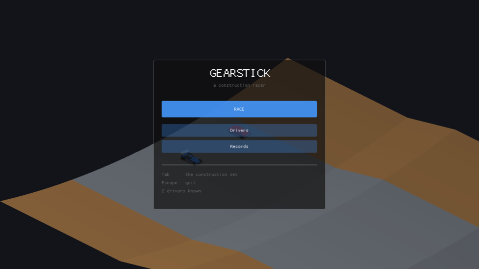
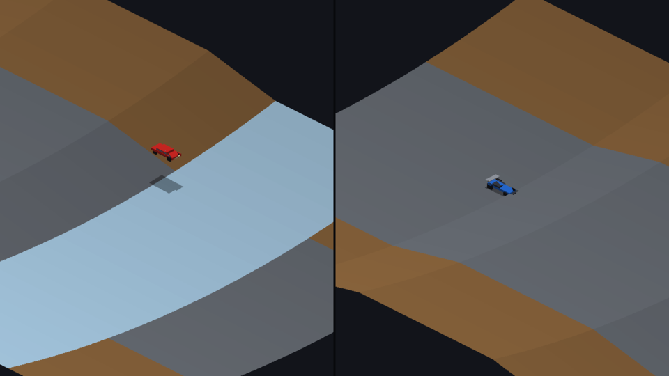
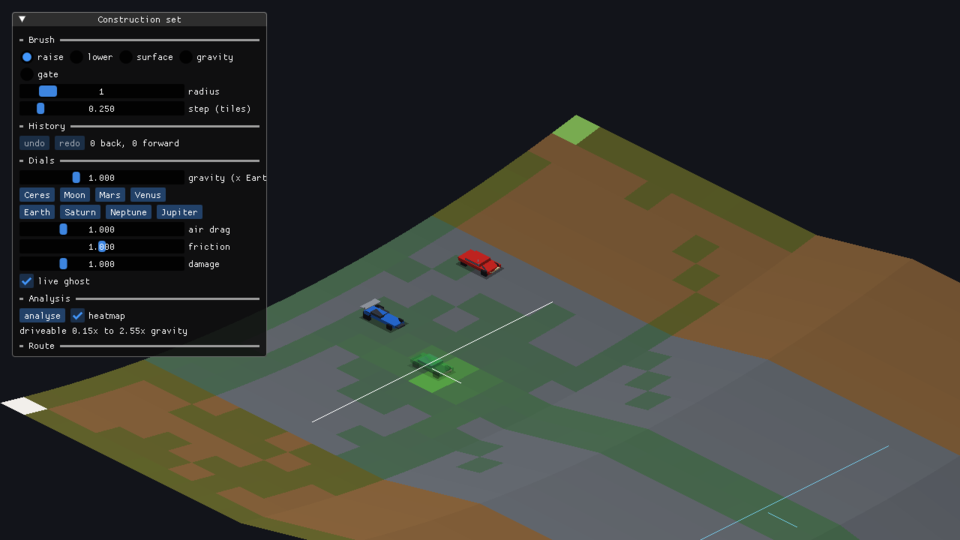
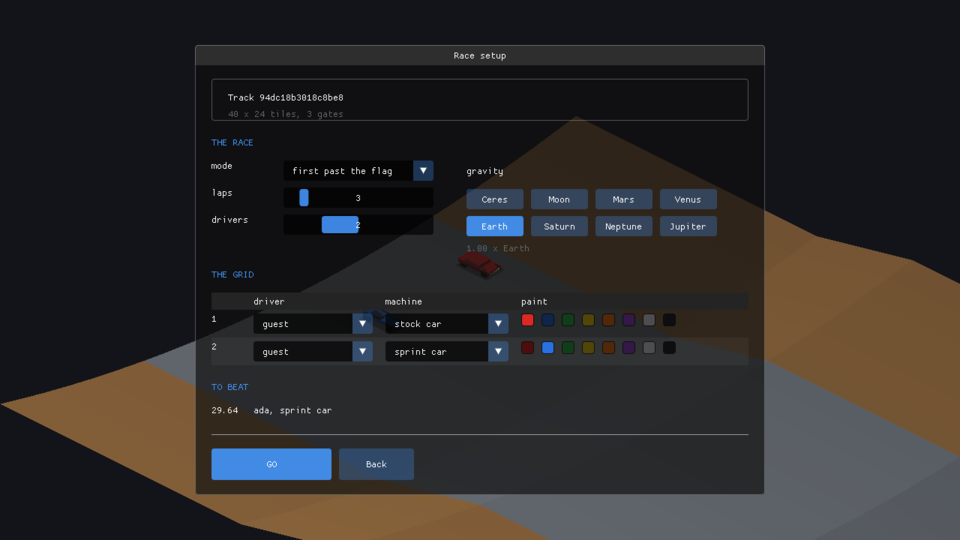
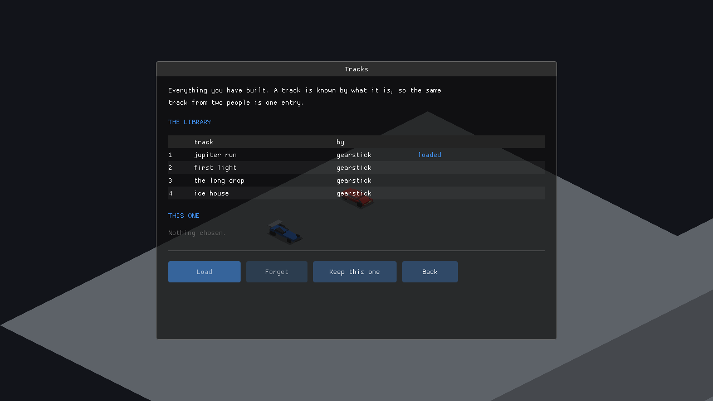
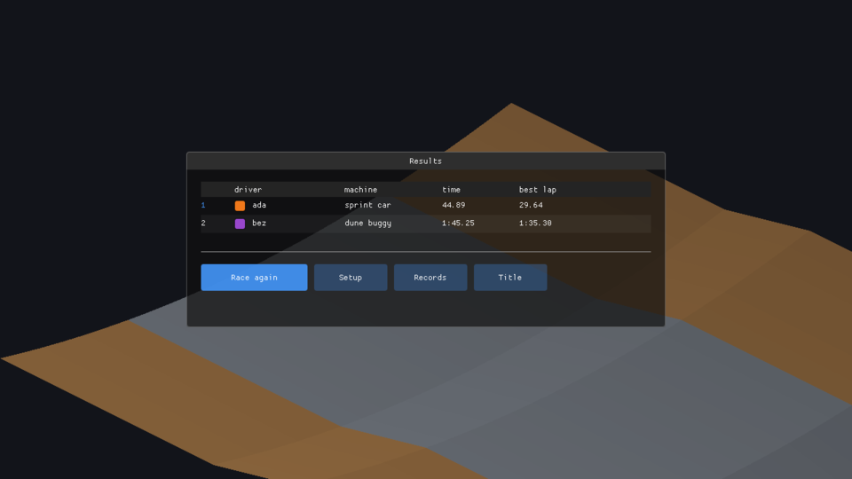
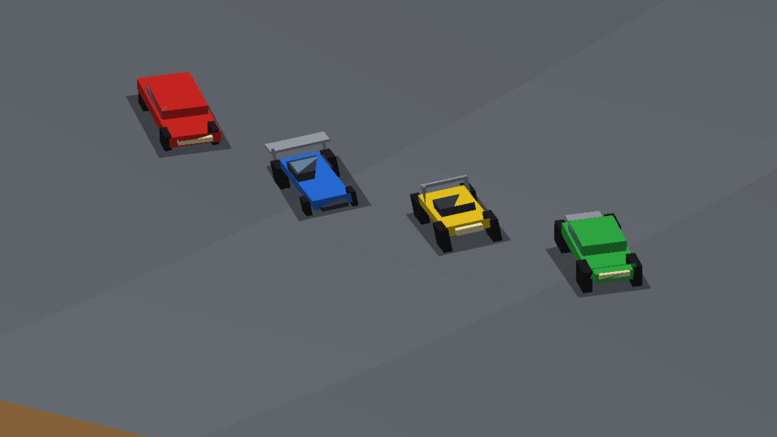
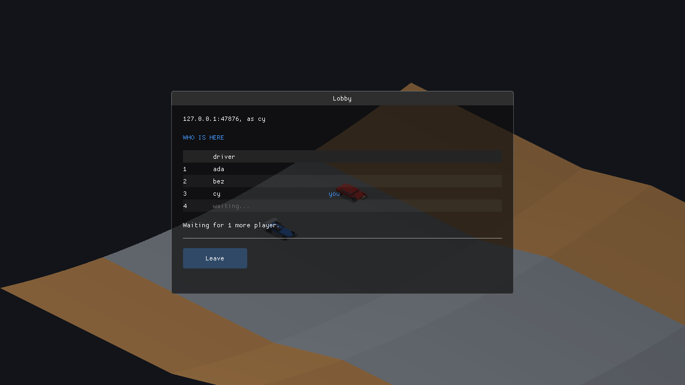

# gearstick

A construction-set racer in C23 and SDL3 — *Racing Destruction Set*, 1985,
continued rather than remade. You build a track, you drive it, and the two are
the same activity.



> **Status: complete — v1.0.0.** Every item in
> [`docs/COMPLETION_PLAN.md`](docs/COMPLETION_PLAN.md) is done — 273 of them,
> each with a verification that was actually run, across all 22 phases. You
> build a track, race up to four people on it locally or online, set a lap
> record, and have a server re-race it to check it and remember it. The
> construction set — the point of the game rather than a feature of it — is
> finished. The one thing outside the version is not code: a hosted machine for
> the central server to live on, whose line goes into `server.txt` the day it
> exists.
>
> [`docs/PROJECT_STATUS.md`](docs/PROJECT_STATUS.md) is the single source of
> truth for what works, with the gaps named plainly and first. Nothing here
> claims more than it has earned.

## The idea

*Racing Destruction Set* handed you fourteen gravity settings, three surfaces, a
two-car track editor and no progression whatsoever, then got out of the way.
Its argument was: **everything is a dial, nothing is locked, the model is simple
enough to predict and therefore exploit, and the chaos is the reward.**

Gearstick continues that argument with the things 1985 could not afford:

- **Gravity is a brush, not a setting.** Every tile carries its own multiplier,
  so a low-gravity pocket at the top of a jump or a Jupiter zone through a
  banked turn is something you paint.
- **Determinism as a product feature.** A race is reproducible from its inputs,
  which is what makes ghosts, replay sharing, a track analyser, rollback netcode
  and server-side verification of a lap time possible at all.
- **A track leaves the room.** As a few hundred characters you can paste into a
  message. The 50-track floppy was a media limitation, not a design choice.

What it deliberately does *not* add — slip curves, progression, a chase camera —
and why, is in [`docs/FEATURES.md`](docs/FEATURES.md). What is defended, from
whom, and what is deliberately not defended, is in
[`docs/THREATS.md`](docs/THREATS.md). Where the art, sound and
tracks come from, and how each is pinned, is in
[`docs/ASSETS.md`](docs/ASSETS.md).

## What it looks like

**Racing.** Isometric, both cars on one screen, because a two-car collision has
to be legible at a glance. The gap between a car and its shadow is the only cue
for how high it is — that was true on a C64 and it is still the most important
pixel in the frame.



**The construction set**, which is the point of the game rather than a feature
of it. Raise and lower terrain, paint surfaces, paint *gravity*, lay a route.
Tab drops you into a test drive on the track you are editing — no save, no load,
no mode change worth noticing. The green wash is the analyser's heatmap: where
every machine actually drove, at nine gravities.



**Setting up a race.** Mode, laps, drivers, gravity from Ceres to Jupiter, and
who is driving what in which colour. The lap record on this track under these
conditions is shown before you start rather than after.



**The library.** Everything you have built, kept by content — so the same track
from two people is one entry, and renaming one does not make it a different
track.



**Results**, with everybody's time, best lap, and who took a record.



**Six machines**, each generated from a parameter table rather than modelled —
there is no third-party art in the game at all. Each one is the best at
something and hopeless at something else, which is checked by a sweep in CI
rather than hoped for.



## Client and server

The game is one program and the server is another. **The server is a librarian
and a referee, never a player**: it holds the lobby, the track library and the
records, and it will verify a submitted lap time by re-racing the inputs that
produced it — which is possible because the simulation is exactly reproducible.

It does *not* simulate a live race. Races are peer-to-peer rollback, so your car
responds to your steering on the frame you press it; a race simulated on a
server would put a round trip between the two. That line is drawn deliberately
and the reasoning is in the platform section of
[`docs/FEATURES.md`](docs/FEATURES.md).

The server runs headless and shows you what it is doing:

```
  gearstick server            port 47800        up 0:00:06
  ------------------------------------------------------------------
      driver           from                     ping       in      out
  0   ada              198.51.100.11:47801          10ms       41       47
  1   bez              198.51.100.12:47801          10ms       41       46
  2   cy               198.51.100.13:47801          10ms       41       45
  3   dot              198.51.100.14:47801          10ms       41       44
  ------------------------------------------------------------------
  4 of 4 here, peak 4        refused 0
  datagrams  in 168 (1.7 KB)   out 182 (6.4 KB)   relayed 0
  rate       28.0 in/s   30.3 out/s
```

```sh
gearstick_server --port 47800 --players 4          # run the meeting point
gearstick --server their-host 47800 --server-key HEX --name ada  # join by address
gearstick --online                                 # or join the default one
```

**There is one server, by design.** Accounts and records that follow you
between machines only mean anything if there is a single place they live, so
peer-to-peer discovery and federation are deliberately out — the reasoning is
in [`docs/FEATURES.md`](docs/FEATURES.md). The game reads that default server's
host, port and public key from a one-line `server.txt` — the shipped one, or
your own in your preference directory — and `gearstick --online` joins it with
nothing typed. The shipped file names no server yet, because there is no hosted
one; what it takes to run yours — a systemd unit, a Dockerfile and four commands
— is in [`deploy/`](deploy/), and the key to paste into `server.txt` is the line
the server logs when it first starts. On a machine with a display the server
also opens a window with the same live view, a log of arrivals and a drop button
beside each client; `--headless` keeps it shut.

Which player you are is the server's decision, not the decision of whoever
started first — that is the difference between a lobby and a host:



## Building

Needs CMake 3.28+, Ninja, and a C23 compiler: GCC 14+, Clang 19+, AppleClang 16+
or MSVC 19.39+. Targets Linux x86_64, Windows x64 and macOS arm64, all 64-bit.

```sh
git submodule update --init --depth 1 \
    ext/sdl ext/imgui ext/sdl_net ext/libsodium ext/sdl_image
cmake --preset linux-release
cmake --build --preset linux-release
ctest --preset linux-release
./build/linux-release/gearstick
```

Presets exist for `linux`, `macos`, `windows` (MSVC) and `windows-clang`, each in
`-debug` and `-release`. To build against an SDL3 the system already has, add
`-DGEARSTICK_USE_SYSTEM_SDL=ON`.

Three programs come out:

| | |
| --- | --- |
| `gearstick` | the game — races, and the construction set |
| `gearstick_server` | the meeting point for online play |
| `gearstick_cli` | the simulation with no window on it |

**The server needs SQLite**, which is fetched once at configure time as the
single-file amalgamation, pinned by SHA-256, and compiled like any other source
file — no package manager and no submodule. A system SQLite is used instead if
there is one. If you would rather not build it at all,
`-DGEARSTICK_SERVER=OFF`.

Nothing else changed: the game and the simulation link no SQLite, and
`gearstick_cli` still links nothing but libc.

## Playing

Run `gearstick` and it opens on the title screen. Say who you are under
**Drivers**, press **RACE**, and press **Tab** at any point to open the
construction set.

Arrows drive car one, WASD car two; pads work, one per car and are what players
three and four need. `Tab` is the construction set, `H` the ghost of your last
run, `G` the painted-gravity overlay, `M` the music, `R` restarts, `Esc` goes
back a screen.

[**The player's guide**](docs/GUIDE.md) has the first ten minutes as a path to
walk, every control, and how to report a bug as a file somebody else can run.

```sh
gearstick                         # single-player, or split-screen with --players
gearstick --online                # race at the default server named in server.txt
gearstick --host 47800 4          # or be the meeting point for four, ad hoc,
gearstick --join their-host 47800 # and join somebody who already is
```

Every flag for every mode is in the [command-line reference](#command-line-reference)
below.

## The headless driver

`gearstick_cli` links the simulation **and nothing else** — no SDL, no window, no
audio device. If it stops linking, the simulation has grown a dependency on
being looked at.

```sh
gearstick_cli selftest --verify   # re-race the fixed scenario, check the hash
gearstick_cli vehicles            # the roster and its numbers
gearstick_cli gravity             # the presets
```

That `--verify` is the tripwire: it re-races a fixed input log and compares one
state hash. If the number moves, every ghost time and every shared replay in
existence just became wrong.

## Command-line reference

Everything below is also printed by `--help` on each program. With no arguments
`gearstick` opens on the title screen; the flags pick a mode or point it at
content. Most of the game's flags are for the game itself — the rest are for
tests, screenshots and the headless tools, grouped last.

### `gearstick` — the game and the construction set

**Modes**

| flag | what it does |
| --- | --- |
| *(none)* | title screen → drivers → race; **Tab** opens the construction set |
| `--editor` | open straight into the construction set |
| `--heatmap` | open the editor with the analyser already run |
| `--showroom` | line up every vehicle, to look at the art |
| `--online` | meet everybody at the default server named in `server.txt` |
| `--server HOST PORT` | meet everybody at a particular server |
| `--host PORT [N]` | be the meeting point yourself, for N players (2–4, default 2) |
| `--join HOST PORT` | join somebody running `--host` |

**Online options**

| flag | what it does |
| --- | --- |
| `--server-key HEX` | the 64-hex-character public key of the server or host, which it prints when it starts |
| `--name NAME` | who to appear as |
| `--manual` | take the manual gearbox rather than the automatic |
| `--relay` | route through the server when two peers cannot connect directly |

**Content and view**

| flag | what it does |
| --- | --- |
| `--track FILE` | open this `.gstrack` rather than the library's first |
| `--ghost FILE` | race against a recorded run |
| `--players N` | one to four, split-screen to match |
| `--zoom N` | camera zoom, 1.0 being one tile to 64 px |

**For tests, screenshots and tooling**

| flag | what it does |
| --- | --- |
| `--shot FILE` | write one frame as a BMP and exit |
| `--shot-at TICK` | which tick to write it at (default 0) |
| `--audio-out FILE` | with `--shot`, write the race as a `.wav` |
| `--ghost-out FILE` | with `--shot`, write the captured run as a ghost |
| `--session` | drive a whole race by itself and stop on the results |
| `--keep` | let a session write what it did to the store |
| `--autodrive` | let the AI drive this machine's car |
| `--trace` | print what is on screen once a second, as `key=value` |
| `--screen NAME` | start on a named screen: `login`, `title`, `drivers`, `setup`, `tracks`, `race`, `results`, `records`, `lobby` |
| `--diverge` | with `--shot`, drive the cars apart to show the split |
| `--overlay` | start with the painted-gravity overlay on |
| `--arc` | start with the landing arc on |
| `--demo-library` | pick a library track, so a screenshot has a selection |
| `--watch-check` | re-watch the finished race from every car and report |

**In-game keys.** Arrows drive car one, WASD car two, pads one per car (players
three and four need pads). **Tab** construction set · **H** ghost of your last
run · **G** painted-gravity overlay · **J** landing arc while airborne · **M**
music · **R** restart · **Backspace** tow to your last checkpoint · **F5**/**F9**
save/load a ghost · **Esc** back a screen.

### `gearstick_server` — the meeting point for online races

| flag | what it does |
| --- | --- |
| `--port N` | listen on this port (default 47800) |
| `--players N` | how many to allow, 1 to 4 (default 4) |
| `--track FILE` | the track this lobby races on |
| `--reversed` | race that track the other way round |
| `--store FILE` | where to remember drivers, records and tracks (its SQLite file) |
| `--key HEX` | this server's 32-byte secret as 64 hex characters; otherwise read from the store, or minted once and kept |
| `--headless` | no window, even on a machine with a display |
| `--plain` | no cursor control — for a dumb terminal, a pipe or a file (which get the log rather than the dashboard) |
| `--timeout N` | drop a client after N ms of silence (default 15000) |
| `--seconds N` | stop after N seconds (for tests) |
| `--window-dump` · `--window-shot FILE` · `--window-press LABEL` | dump, capture or drive the window (for tests) |

The address to hand players is `HOST PORT` plus the `--key` line the server logs
at startup; running one for real is written up in [`deploy/`](deploy/).

### `gearstick_cli` — the simulation with no window on it

Links the simulation and nothing else. Each subcommand runs and exits:

| command | what it does |
| --- | --- |
| `selftest [--verify]` | race the fixed scenario and print — or, with `--verify`, check — its state hash |
| `opponents [--verify]` | race four opponents and print or check the hash |
| `track FILE` | write the selftest track, read it back, and check it survived the round trip |
| `circuit FILE` | write the short circuit the AI is proved on, for a server to serve |
| `validate` | show what the route checker accepts and refuses |
| `analyse FILE` | which gravities and machines can get round a track |
| `generate [N]` | make N tracks from seeds and analyse every one |
| `ai` | race the AI round a circuit in every condition |
| `pace` | lap times for a cautious, a normal and a quick driver |
| `roster` | race every vehicle over every condition |
| `vehicles` | the roster and its numbers |
| `gravity` | the gravity presets |
| `import [FILE]` | read a Stunts `.trk` (with no file, make one first) |
| `code FILE` · `url FILE` | print a track as a pasteable code, or as a link |
| `decode CODE [FILE]` | read a code, optionally writing the track out |

## Layout

```
src/core/       the simulation - links nothing, integers only, no pointers in state
src/gfx/        isometric projection, terrain geometry, generated vehicle meshes
src/audio/      the engine note and the music, both synthesised
src/ui/         the front end and the construction set
src/net/        what clients and the server say to each other
src/platform/   asset paths, keyboard, gamepad, sockets
src/frontend/   one main.c per executable: game/, server/ and cli/
cmake/          platform gate, warning set, layer and float checks, SQLite
tools/          the trig table baker, the vehicle mesh generator
ext/            pinned submodules - see ext/README.md
docs/           GUIDE.md, RELEASES.md, FEATURES.md, COMPLETION_PLAN.md,
                PROJECT_STATUS.md, ASSETS.md, THREATS.md
```

The layering is enforced at configure time rather than remembered:
`src/core/` may not include SDL, may not use floating point, and holds no
pointers in the world state. Everything good here is downstream of that —
replays, ghosts, the analyser, rollback, and a server that can re-race a
submitted time to check it.

## Licence

GPL-3.0-or-later. See [LICENSE](LICENSE).

The original *Racing Destruction Set* is EA's, 1985, by Rick Koenig, Connie
Goldman and Dave Warhol. None of its tracks, art or code are here, and none will
be.
